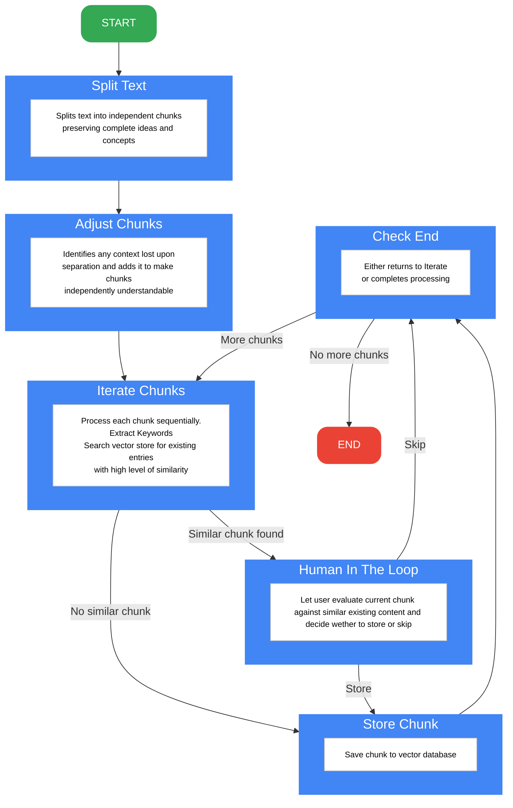

# LangGraph Vector Store Builder

A multi-agent text processing pipeline orchestrated by LangGraph, where specialized AI agents work in sequence to analyze, chunk, and index textual content. Each agent handles a specific task - from intelligent text splitting to context preservation and keyword extraction - with human-in-the-loop verification ensuring quality. The pipeline is applicable for building semantic search systems, knowledge bases, and deduplication systems.

## Overview

This project provides an intelligent system for processing text documents into a high-quality vector store where each stored chunk is individually understandable. The pipeline leverages multiple AI agents, each specialized for its task:
- A splitting agent that preserves semantic completeness
- A context analysis agent that ensures chunk independence
- A keyword extraction agent that identifies key concepts
- A similarity detection agent that prevents duplicates

The pipeline can run in LangGraph Studio for visual workflow monitoring or through a Streamlit interface for user-friendly operations.

## Architecture



## Features

- 🔄 Multi-stage text processing pipeline
- 🧠 AI-powered text chunking and context analysis
- 🔍 Semantic similarity search
- 👤 Human-in-the-loop verification
- 📊 Vector store integration with Pinecone
- 🎯 Keyword extraction and indexing

## Technology Stack

- **LangGraph** - For orchestrating the AI processing pipeline
- **LangChain** - Core framework for AI operations
- **Anthropic Claude** - Primary AI model for text analysis and chunk adjustment
- **OpenAI** - Provides embeddings for vector storage via `text-embedding-ada-002`
- **Pinecone** - Serverless vector database for semantic storage
- **Streamlit** - User interface for content processing
- **Python 3.12+** - Core programming language


## Getting Started

1. Clone the repository
2. Install dependencies:
```bash
pip install -r requirements.txt
```

3. Set up environment variables in `.env`:
```bash
PINECONE_API_KEY=your_api_key
PINECONE_INDEX_NAME=your_index_name
ANTHROPIC_API_KEY=your_api_key
OPENAI_API_KEY=your_api_key
```

## Running the Application

### Option 1: LangGraph Studio

The project includes a `langgraph.json` configuration file for seamless integration with LangGraph Studio:

1. Install LangGraph Studio
2. In LangGraph Studio, open the project directory 

### Option 2: Streamlit Interface

For a more user-friendly experience, use the Streamlit interface:

1. Run the application:
```bash
streamlit run app.py
```

2. Access features through the web interface:
   - Upload or paste text content
   - Review text chunks and their metadata
   - Verify similar content matches
   - Monitor processing progress
   - View indexed results

The Streamlit interface provides real-time feedback and allows for human verification at critical steps in the processing pipeline.

## How It Works

1. **Text Splitting**: Intelligently splits input text into coherent chunks
2. **Context Analysis**: Ensures each chunk maintains necessary context
3. **Keyword Extraction**: Identifies key terms and concepts
4. **Similarity Check**: Compares against existing entries
5. **Human Verification**: Optional review of similar content
6. **Vector Storage**: Indexes verified chunks in Pinecone

## Use Cases

- Document processing and indexing
- Knowledge base construction
- Content deduplication
- Semantic search systems
- AI training data preparation

## Contributing

Contributions are welcome! Please feel free to submit a Pull Request.

## License

MIT License - feel free to use this project for your own purposes.
```